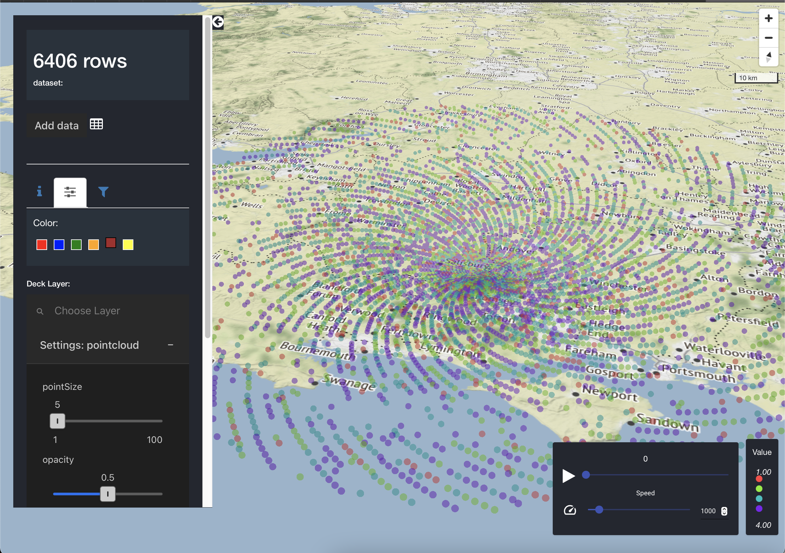

<!-- README.md is generated from README.Rmd. Please edit that file -->

```{r setup, include = FALSE}
knitr::opts_chunk$set(
  collapse = TRUE,
  comment = "#>"
)
```


# bioAtlas 
[](https://www.repostatus.org/#wip)

This is a Work In Progress repository README file and does not include detailed user, developer or technical documentations. It outlines the work carried out and the future estimation of work to obtain a UK wide Bug Map using radar data.

This repository was created from [TGVE](https://github.com/layik/eAtlas) [template repository](https://github.com/layik/eatlas-template) which pulls TGVE from npm and has its own rPlumber based API. It includes a functional Dockerfile which was used to deply an instance of it on a JASMIN [@lawrence2012jasmin] development/test server. 

## Work done

### Summary

The majority of the work was done under the contract duration of 10th June 2021 - 27th July 2021. The body of work consisted of:

* Understanding the data (mostly parsing .h5)
* Getting the backend, including API endpoints ready to serve data
* Upstream work into TGVE (eAtlas) to support the only layer ysed (DeckGL layer PointCloudLayer) and minor other work.
* Setup the codebase, Dockerfile and other CI to prepare more work
* Deployment and setup of the JASMIN [@lawrence2012jasmin] server including reading/updating data source from the JASMIN servers.

### Description

Radar data is conventionally two dimentional graphs (heatmaps) and they can be seen on news broadcasts focused on meteorological data visualization (see [@bioRad] for R based visualizations). In contrast, bioAtlas and the team at University of Leeds focus on entomological data visualization, that is radar data which detects bugs. 

The work has been carried out with a simple scenario in mind, being able to see how a bug cloud (Horde, Nest, Plague, Rabble, Swarm from a dictionary lookup) moves across an image created by visualizing each "voxel" in a 360 (azimuth) x 425 (range) radar. In this simple scenario we imaging a cloud of bugs being detected on a radar and they move within the radar range and thus we can visualize each point/voxel using a point within the 3D (2.5D) space visualized. See Figure 1 for what has been developed so far which shows nothing specific. The reflectivity of the radar has been super-simplified into four categories for illustration/colouring purposes only (please see `bdformats` repository for samples of real raw reflectivity data).

```{r screenshot, echo=FALSE, fig.cap="A screenshot of the latest development work of BioAtlas project", out.width = '90%'}

```

## Estimating future work

To estimate the work on a fully working and publically available `bioAtlas`, this is where we have ~15 radar data aggregates (in the current aggregate format) and we need to swithc between those radars to see their (bug maps), the estimate would be as follows being the minimum time required:

```{r future, echo=FALSE}
library(kableExtra)
df = data.frame(title="API/backend", Notes=NA, Weeks=1)
df = rbind(df, data.frame(title="Front/TGVE", Weeks=3, Notes="Including minor/moderate changes to TGVE"))
df = rbind(df, data.frame(title="Deploy/Devops", Weeks=1, Notes="Including CI setup?"))
df = rbind(df, data.frame(title="Data Prep", Weeks="?", Notes="etc.."))
df = rbind(df, data.frame(title="TOTAL", Weeks="> 5", Notes=""))
kable(df) 
# %>%
  # kable_styling(bootstrap_options = c("striped", "hover", "condensed", "responsive"))
```

<!-- * Finish off any API, data source piping etc:  -->

There was little time to add a Gantt chart using [this](https://mermaid-js.github.io/mermaid-live-editor) great OSS tool.

## July 27th

* Still serving single file from github for GH Pages
* Wrapping up with aggregate .h5 file
* Estimate the national data switching between Radars
* Overall docs to then come back to.

## July 5th

Meeting notes & 3D radar image. More later.


## June 24th

We can now translate all azimuth and range values of the radar to xyz. The DeckGL pointcloudlayer and the scatterplotlayers can visualize the points. Attention now is on zdr values to detect insects. Then we can look at how we can detect their shapes from the radar beam heights. 

## Start 11th June
So far, we have been able to translate each value in a ODIM format hdf5 `dataset1/data1/data`'s 360x425 table (total of 153k) into lon/lat pairs from the radar's origin (so far just a 2D plane) thanks to Dr Christopher Hassall.

In this eAtlas repo, the aim is getting [that R code](https://github.com/biodar/bdformats/blob/e77bee40fb6ebf5e76cd9c68691d0c67f3d110fa/Reading%20HDF5%20in%20R.R) into JS using [jsfive](https://github.com/usnistgov/jsfive).

## Note
This is a template repository to use the Turing Geo-visualization Engine (TGVE or eAtlas) in a React app and deploying it in github pages. Most of the dev work is done using TGVE/npm branch locally and could be pushed here too.

# References